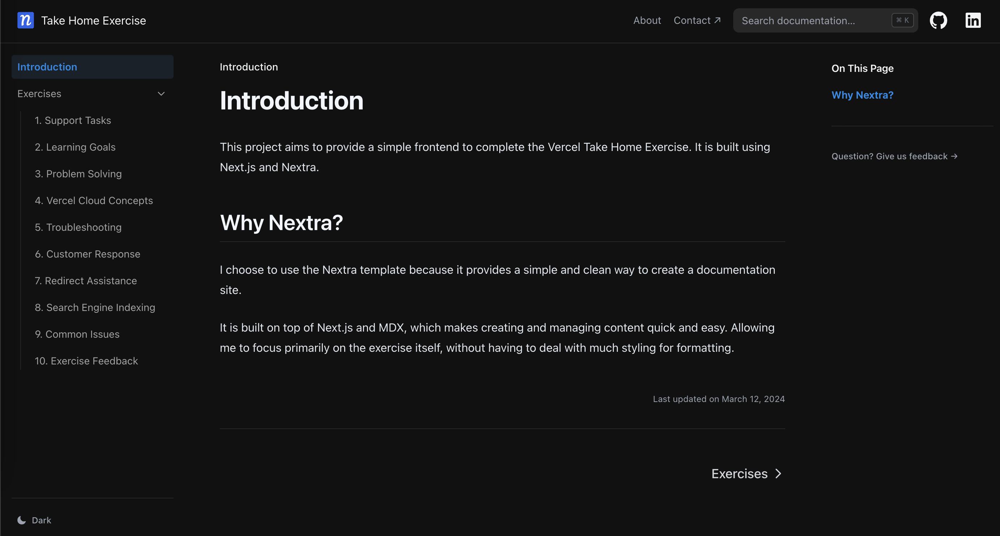

# Vercel Take Home Exercise

This project aims to provide a simple frontend to complete the Vercel Take Home Exercise. It is built using Next.js and Nextra.

## Why Nextra?

I choose to use the Nextra template because it provides a simple and clean way to create a documentation site.

It is built on top of Next.js and MDX, which makes creating and managing content quick and easy. Allowing me to focus primarily on the exercise itself, without having to deal with much styling for formatting.

## Local Development

First, run `pnpm i` to install the dependencies.

Then, run `pnpm dev` to start the development server and visit localhost:3000.

## License

This project is licensed under the MIT License.
